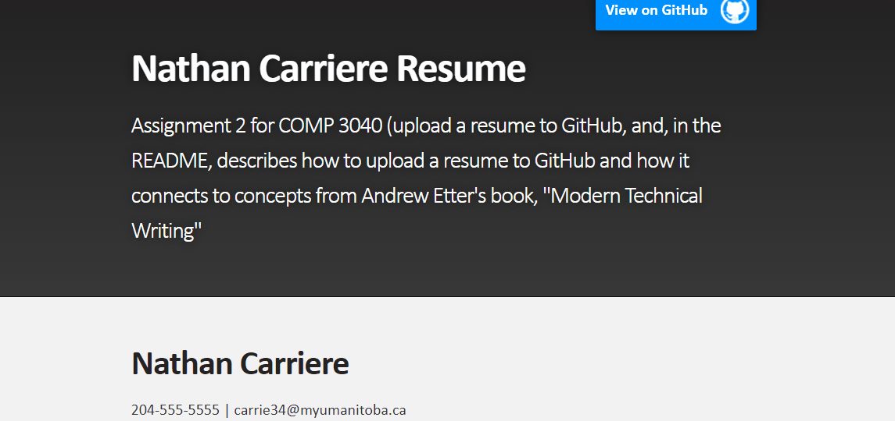

# Applying Etter's *Modern Technical Writing* Principles to Host an Online Resume and Readme

### Purpose

The goal of this article is to teach and demonstrate the key principles of [*Modern Technical Writing*](https://www.amazon.ca/Modern-Technical-Writing-Introduction-Documentation-ebook/dp/B01A2QL9SS) by Andrew Etter. This will be done by instructing the reader how to host a resume on [GitHub Pages](https://docs.github.com/en/free-pro-team@latest/github/working-with-github-pages/about-github-pages). This assumes a novice level of computer science knowledge with no Markdown or Github experience required. This is intended for Windows users.

### Table of Contents

- [Prerequisites](#prerequisites)

- [Instructions](#instructions)

- [Frequently Asked Questions](#frequently-asked-questions)

- [More Resources](#more-resources)

- [Authors and Acknowledgements](#authors-and-acknowledgements)

### Prerequisites

- Have a [Github](https://github.com/) account.

- Have some familiarity with [Markdown](https://en.wikipedia.org/wiki/Markdown). For a quick run through, see [this reference](https://wordpress.com/support/markdown-quick-reference/) or [this guide](https://guides.github.com/features/mastering-markdown/). For an in-depth tutorial (shouldn't be necessary), see [here](https://www.markdowntutorial.com/).

- Have [Marktext](https://github.com/marktext/marktext/blob/develop/README.md) downloaded (or some other Markdown editor capable of editing [GitHub Flavored Markdown](https://github.github.com/gfm/)).

- Have [Github Desktop](https://desktop.github.com/) downloaded if you're unfamiliar with using git.

- A Markdown-formatted resume (I recommend using the Marktext editor for this - if you can use Microsoft Word, then you can write a resume in Marktext). 
  
  - *Why use Markdown?*
    
    - *Using lightweight markup is key principle of Etter's book. Etter recommends this because it is easier to read and write and so is accessible to a wider range of people, which means that more people can contribute to documentation. Etter recommends Markdown because it is the most widely used lightweight markup language and is likely more future-proofed.*

### Instructions

This is a step-by-step demonstration on how to use *Modern Technical Writing*'s key principles to host a resume on Github Pages.

1. Create a new Github repository called `[YourUsername].github.io`
   
   - If using Github Desktop, a new repository can be created through File > Create New Repository. Set the repository name to `[YourUsername].github.io`.
     
               
- *Why use Github?*
  
  - *Github corresponds to Etter's key principle on using distributed version control. Etter recommends this because it provides better performance, facilitates concurrent work on the same file, and makes "undo-ing" things quite simple. It also makes your job easier, since a developer, tester, or expert user can make pull requests to the documentation upon noticing something is incorrect or out of date.*
2. Commit your markdown-formatted resume to your Github repository. 
   
   - If using Github Desktop: 
     
     - You can use "Show in Explorer" to move your resume to the local repository.
     
     - Once your resume is added to your local repository, you can [commit](https://github.com/git-guides/git-commit) your changes using the "commit" panel at the bottom left.   
     

3. Push to the remote repository. 
   
   - If using Github Desktop:
     
     - To [push](https://www.atlassian.com/git/tutorials/syncing/git-push#:~:text=The%20git%20push%20command%20is,exports%20commits%20to%20remote%20branches.) your changes, press "push". The button should appear after all your changes have been committed. This may sometimes require you to "pull" first. If that is the case, then feel free to click "pull" before you push. 

4. Your resume should now be on a Github repository. Navigate to this in a browser by visiting github.com/[YourUsername]/[YourRepositoryName]. All your uploaded files should  be visible from there.  

5. Now we will set up Github Pages and Jekyll
   
   - .Navigate to Github settings.
   
   - Scroll to the "GitHub Pages" section and press "Change Theme". Choose any theme for now. You can always come back and change it later. 
   
   - *Why use Github Pages and Jekyll?*
     
     - *Github Pages corresponds to Etter's key principle on using static websites. Etter recommends static sites because they are very simple and are not prone to crashing or being hacked.*
     
     - *Jekyll corresponds to Etter's key principle on using static site generators. Etter recommends these because they can help you create highly functional and beautiful static sites with minimal effort.*

6. Your resume should now be visible on Github Pages at `[RepositoryName]/[FileName]`. It might take a few minutes. In my case, I was able to view my resume at `https://nathancarriere.github.io/7790382_A2_resume` since I named my resume file `7790382_A2_resume.md` and my repository `NathanCarriere.github.io`. [Check it out](https://nathancarriere.github.io/7790382_A2_resume)!

### Frequently Asked Questions

###### Why is Markdown better than a word processor?

- Markdown is a markup language designed to be viewed on the web. It's designed to have CSS and other technology run through it efficiently. This is why websites use markup languages instead of Microsoft Word .docx files. (Also, good luck trying to navigate or read [the mess that is .docx raw source code](https://www.toptal.com/xml/an-informal-introduction-to-docx))

**I can see the README on Github Pages but not my resume. What's wrong?**

- If this is the case, there's a good chance you're just looking at the wrong URL. For example instead of viewing `https://www.RepositoryName`, you might want to go to `https://www.RepositoryName/`.

#### More Resources

- [*Modern Technical Writing*](https://www.amazon.ca/Modern-Technical-Writing-Introduction-Documentation-ebook/dp/B01A2QL9SS) By Andrew Etter

#### Authors and Acknowledgements

- Nathan Carriere

- Other group members:
  
  - Drew Weber
  
  - Patient Ndayizeye
  
  - Tamunotonye Dawari

- Jekyll theme: [slate](https://github.com/slatedocs/slate)

- Template credit: 
  
  - University of Manitoba
  
  - Course: COMP 3040 A01, Fall 2020
  
  - Course Instructor: Christina Penner
